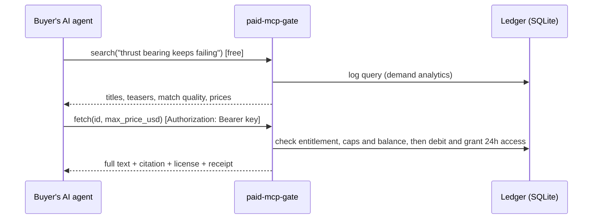

# paid-mcp-gate

**Turn a proprietary knowledge base into a paid service that AI agents can buy from, per question.**

AI agents are becoming the main readers of specialist knowledge. When they cannot reach it, they guess;
when they can, they usually take it without paying. `paid-mcp-gate` puts a gate in front of a knowledge base and
exposes it over the [Model Context Protocol (MCP)](https://modelcontextprotocol.io), the standard way agents connect to
tools and data:

- **Search is free.** Agents see teasers, match quality and the price of every result before anything is charged.
- **Reading costs money.** Agents buy a whole document, or just the few passages they need, from a prepaid account.
- **Every delivery carries a license and a citation.** No model training, no redistribution, bounded caching, attribution required.
- **The publisher sees the market.** Revenue, best sellers, buyers, paywall hits, and the questions agents asked that the knowledge base could not answer.

> Why this matters as a business, who buys, who sells, and how to make money from it: see **[docs/STRATEGY.md](docs/STRATEGY.md)**.

## See it work in 30 seconds

```bash
npm install
npm run demo
```

The demo starts a real server with a sample knowledge base (a fictional pump-reliability consultancy) and drives it
with a real MCP client acting as a buyer's agent (output abridged):

```text
2. It searches for free
  agent → search("boiler feed pump thrust bearing keeps failing")
  gate  ← [strong ] FA-2019-017: Repeated thrust-bearing failures on a boiler feed pump
          $0.25 · matched section "Root cause"
3. It tries to read the best match: the paywall explains how to get access
  gate  ← authentication_required: "FA-2019-017: ..." costs $0.25. An API key is needed to buy it.
5. With a key, the agent buys the failure analysis
  gate  ← purchased: charged $0.25, balance $1.75
          license: AI training prohibited, cache at most 24h, licensee acct_…
6. Later it needs the document again: already owned, nothing charged
7. It needs one number, so it buys two passages instead of a whole report
  gate  ← charged $0.75, balance $1.00
8. Spending guardrail: price_exceeds_max … Nothing was charged.
9. Out of credit: payment_required … Top up credits to continue.
10. A question the knowledge base cannot answer → recorded as a content gap
11. What the publisher sees: revenue $1.00, paywall hits 2 ($1.75 of demand not converted), content gaps
```

## Run it

Requires Node.js 22.18 or newer. The code is TypeScript that Node runs directly, and the ledger uses Node's built-in
SQLite, so there is no build step and there are no native dependencies.

```bash
npm install
PMG_ADMIN_TOKEN=choose-a-secret npm start       # serves the bundled example on http://127.0.0.1:8787

# In another terminal: onboard a buyer. The API key is printed once.
npm run pmg -- account create --name "Acme AI" --email ai@acme.example --credit 25
```

- `http://127.0.0.1:8787/`: public landing page with prices, license terms and connection instructions
- `http://127.0.0.1:8787/mcp`: the MCP endpoint (Streamable HTTP)
- `http://127.0.0.1:8787/admin`: publisher dashboard (HTTP Basic auth: any username, password = `PMG_ADMIN_TOKEN`)

Connect an agent, for example Claude Code:

```bash
claude mcp add --transport http tarnwick http://127.0.0.1:8787/mcp --header "Authorization: Bearer <API key>"
```

### Use your own knowledge base

1. Copy `examples/tarnwick/gate.config.json` to `gate.config.json` and edit the publisher, offering, prices and license.
2. Put Markdown files in the folder named by `knowledge.path`. Sub-folders become collections. Optional frontmatter:

   ```markdown
   ---
   id: fa-2019-017
   title: "FA-2019-017: Repeated thrust-bearing failures"
   collection: failure-analyses
   updated: 2024-05-14
   url: https://kb.example.com/fa/2019-017
   summary: The teaser agents see before paying. Sell the answer, don't give it away.
   price_usd: 0.40
   ---
   ```

3. Check prices with `npm run pmg -- docs`, then `npm start`.

Files and folders starting with `_` or `.` are ignored, which is useful for drafts.

## How it works



| MCP tool | Cost | What it does |
| --- | --- | --- |
| `search` | free | Ranked documents with a teaser, the matched section, match quality (strong/partial/weak), price and whether the caller already owns it |
| `fetch` | per document | Full text with citation, license terms and receipt. Re-fetching within the entitlement window is free. `max_price_usd` caps the price |
| `retrieve_passages` | per passage | The most relevant excerpts for a question, priced as a share of their document's price. Free for documents the caller owns |
| `get_offering` | free | Publisher, collections, prices, license, how to get a key |
| `get_account` | free | Balance, today's spend against the daily cap, owned documents, recent charges |

Paywall and limit responses are ordinary tool results with `isError: true` and a structured body such as
`{"error": "payment_required", "price_usd": 1.5, "balance_usd": 1, "how_to_get_access": {...}}`. The model reads
them and can tell its user what to do. Other outcomes are `authentication_required`, `price_exceeds_max`,
`daily_spend_cap_reached`, `daily_document_limit_reached` and `not_found`.

### Design choices worth knowing

- **Teasers are publisher-controlled.** If a document has a `summary`, agents see that instead of an automatic
  excerpt. The first version showed the best-matching excerpt, and for a failure analysis that gave away the root cause.
- **Money is integer micro-dollars** in an append-only ledger. Each charge is one SQLite transaction that checks the
  daily cap and the balance, debits the account, writes one ledger line per item and grants access. Nothing is written if a check fails.
- **Buyer protection is built in:** per-call `max_price_usd`, a daily spend cap per account, and free re-reads.
- **Bulk-export protection:** a daily cap on new documents per account pushes whole-corpus buyers towards a bulk license.
- **Demand analytics:** searches whose best result covers less than half of the query are reported as unmet demand.
  Paywall hits are reported per document, as sales leads.
- **Stateless MCP server:** one server instance per HTTP request, bound to that caller, so it scales horizontally.
  The ledger is the only state.
- **Security:** API keys are stored as SHA-256 hashes. Loopback deployments only accept loopback `Host` headers
  (DNS-rebinding protection). Request bodies are capped at 1 MB. Callers are rate-limited per key or IP. The admin
  dashboard is disabled unless `PMG_ADMIN_TOKEN` is set. Pages are escaped and served with a strict CSP.

### Configuration reference

All sections except `publisher` and `offering` are optional. Defaults are in [`src/config.ts`](src/config.ts).

| Section | Keys |
| --- | --- |
| `collections.<id>` | `title`, `description`, `fetch_usd` |
| `pricing` | `default_fetch_usd` (0.05), `passage_fraction` (0.25), `passage_min_usd` (0.01) |
| `license` | `name`, `url`, `ai_training`, `redistribution`, `max_cache_hours` (24), `attribution` |
| `access` | `entitlement_hours` (24), `teaser_chars` (160), `max_search_results` (10), `max_passages` (5) |
| `limits` | `requests_per_minute` (120), `anonymous_requests_per_minute` (30), `daily_spend_cap_usd` (100), `max_new_documents_per_day` (200) |
| `analytics` | `log_queries` (true). Turn it off if buyers' queries are confidential |
| `server` | `host` (127.0.0.1), `port` (8787), `public_url`, `trust_proxy`, `allowed_hosts` |
| `database` | `path` (data/gate.db) |

For a public deployment, set `server.host` to `0.0.0.0`, `server.public_url` to the external URL, `allowed_hosts` to your
domain, and `trust_proxy: true` when running behind a reverse proxy.

### CLI

```text
npm run pmg -- serve | docs | stats
npm run pmg -- account create --name <name> [--email <email>] [--credit <usd>] [--daily-cap <usd>]
npm run pmg -- account list | account disable --account <id> | account enable --account <id>
npm run pmg -- key create --account <id> [--label <text>] | key revoke --id <key id>
npm run pmg -- credit add --account <id> --usd <amount> [--note <text>]
```

## Development

```bash
npm test            # 51 tests: search, Markdown loading, the money rules, and MCP over HTTP with the SDK client
npm run typecheck
npm run demo
```

```text
src/
  gate.ts          business rules: what is free, what costs money, what a buyer receives
  store.ts         SQLite ledger: accounts, hashed keys, charges, entitlements, analytics
  mcp.ts           MCP tools (thin adapter over the gate)
  http.ts          Streamable HTTP endpoint, auth, rate limits, landing page, admin
  knowledge/       Markdown loader, section chunking, BM25 search, teasers
  pricing.ts       price resolution: document > collection > default
  pages.ts         landing page and dashboard (server-rendered, no JavaScript)
  cli.ts           publisher CLI
examples/tarnwick  fictional sample knowledge base used by the demo
```

## Status and roadmap

This is a working prototype for demos and pilots, not yet a hosted product. Known gaps, in the order customers are
likely to ask for them:

1. **Self-serve credit top-ups** with Stripe Checkout and invoices. Today the publisher adds credit with the CLI.
2. **Subscriber passthrough:** give existing subscribers keys on an "included" plan, so the new channel does not cannibalise subscriptions. This is how LSEG, FactSet and S&P expose data over MCP today.
3. **Keyless pay-per-call with x402** over MCP, for agents with wallets (for example AWS Bedrock AgentCore payments). Then Stripe's Machine Payments Protocol.
4. **OAuth 2.1** for AI apps whose connectors sign in with OAuth rather than an API-key header. API keys already work with Claude Code, Cursor and custom agents.
5. **Real sources:** SharePoint, Confluence, Postgres and document stores, plus hybrid (vector + keyword) search.
6. **Machine-readable licensing** aligned with the RSL standard, and pricing for verified agents with Web Bot Auth.
7. **Proxy mode:** meter and charge for an existing MCP server's tools.
8. **MCP spec 2026-07-28:** the MCP SDK used here (1.30.1) negotiates protocol versions up to 2025-11-25.
9. **Leak deterrence:** per-buyer canary text and bulk-scraping detection.
10. **npm package and Docker image.** Node refuses to strip types inside `node_modules`, so publishing needs a build step.

## License

MIT. The sample knowledge base in `examples/tarnwick` is fictional and is not engineering advice.
